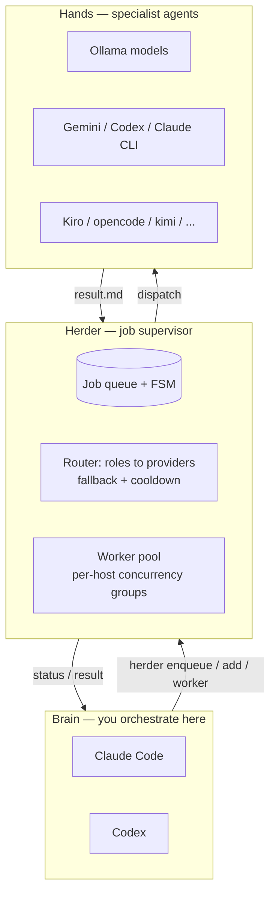
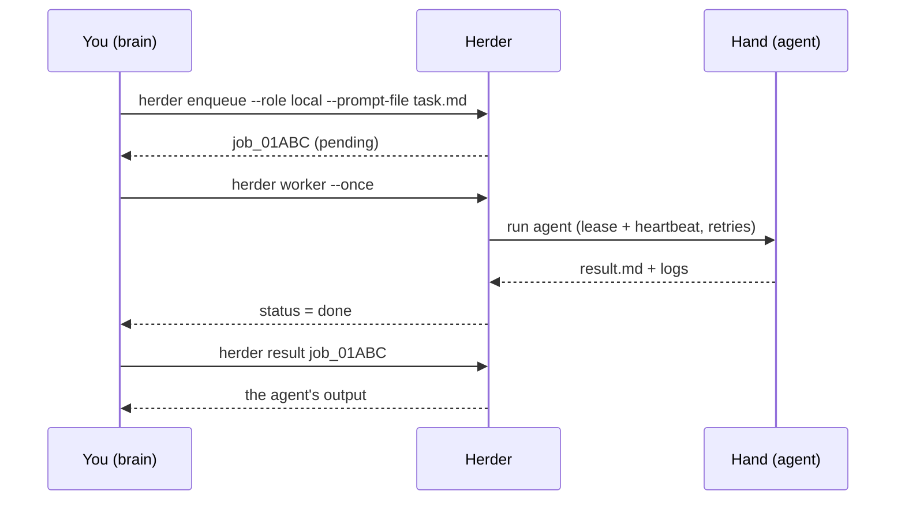
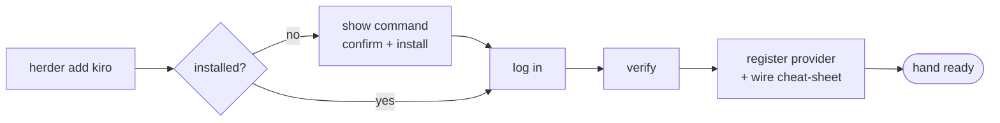

# Herder

**A local job supervisor that runs AI CLI agents as background "hands" — orchestrated from your AI "brain" (Claude Code or Codex).**

You stay in your brain (Claude Code / Codex). Herder gives it **hands**: specialist
agents (Ollama models, Gemini, Kiro, opencode, …) that run jobs in the background.
The brain decides *what* to do and delegates; Herder queues, routes, runs, and
returns results. Connecting a new hand is one guided command.

```text
🧠 Brain (Claude Code / Codex)  →  Herder (queue · route · run)  →  🦾 Hands (agents)
            ▲                                                              │
            └──────────────────────  result / status  ────────────────────┘
```

---

## Contents

- [Why Herder](#why-herder)
- [How it works](#how-it-works)
- [Install / setup](#install--setup)
- [Quick start](#quick-start)
- [Commands](#commands)
- [Configuration](#configuration)
- [Connecting a hand](#connecting-a-hand)
- [Concepts](#concepts)
- [Contributing](#contributing)
- [License](#license)

---

## Why Herder

Your brain (Claude Code / Codex) is smart and orchestrates well — but it is one
process, doing one thing at a time, costing frontier tokens. Herder lets it
**delegate the bulk work to cheaper / local / parallel agents** and stay in
control:

- **Brain-agnostic.** The same setup works under Claude Code *or* Codex; state
  lives in Herder, so you can swap brains freely.
- **One command to add a hand.** `herder add kiro` → detect → install → log in →
  ready. Recipes are plain YAML; adding a new agent is one file.
- **Run anything as a job.** Any CLI agent (`claude`, `codex`, `gemini`,
  `ollama`, `opencode`, `kimi`, …) becomes a background job with retries,
  heartbeats, logs and results.
- **Smart routing.** Roles map to a priority list of providers with automatic
  **fallback** and **cooldown**; per-host **concurrency groups** stop two models
  on the same machine from thrashing.

---

## How it works

### Architecture



### A job, end to end



### Onboarding a hand (`herder add`)



---

## Install / setup

### Prerequisites

- **Python 3.12+**
- **[uv](https://docs.astral.sh/uv/)** (the installer below sets it up if missing)
- A **brain** — install at least one first:
  - Claude Code → <https://claude.ai/download>
  - Codex → <https://github.com/openai/codex>

### Option A — clone and inspect first (recommended)

```sh
git clone https://github.com/cleonhp88/herder
cd herder
sh install.sh          # installs uv if needed, then: uv tool install .
```

### Option B — one-liner

```sh
curl -LsSf https://raw.githubusercontent.com/cleonhp88/herder/main/install.sh | sh
```

> The one-liner downloads and runs a script from GitHub. Prefer Option A if you
> want to read `install.sh` before running it.

`install.sh` puts a `herder` command on your `PATH` (via `uv tool install`).
Verify the install:

```sh
herder --help
```

---

## Quick start

Three commands from zero to a working hand:

```sh
herder init          # 1. first-run setup
herder add           # 2. connect a hand (guided)
# 3. open Claude Code or Codex and just talk — it reads the cheat-sheet and calls hands
```

**`herder init`** — creates `config.yaml` (from the bundled template), detects
your brain(s), wires a cheat-sheet into `CLAUDE.md` / `AGENTS.md`, and runs a
provider health check:

```console
$ herder init
=== Herder init ===
created config.yaml at /your/project/config.yaml
brains detected: Claude Code, Codex
wiring brain target files:
  CLAUDE.md: created
  AGENTS.md: created
provider readiness:
  echo_cli       ok
  1/1 providers ready

Done. Run 'herder add' to connect more hands.
```

**`herder add`** — pick a hand; Herder installs it (with your confirmation), logs
you in, verifies it, and registers it:

```console
$ herder add
Available agents (run 'herder add <agent>' to install):
  ✓ kiro             installed

$ herder add kiro
# detect → (confirm) install → login → verify → registered ✓
```

### Run your first job

```console
$ printf 'Summarise idempotency in one sentence.' > task.md

$ herder enqueue --project myproj --role local --kind research --prompt-file task.md
enqueued job_01KV7V5AHPAB64CJ66SQRYZKZ7 status=pending

$ herder worker --once
processed 1 job(s)

$ herder result job_01KV7V5AHPAB64CJ66SQRYZKZ7
status: done
---
Idempotency means an operation can be applied many times without changing the
result beyond the first application.
```

---

## Commands

Run `herder <command> --help` for full options.

| Command | What it does | Example |
|---|---|---|
| `init` | First-run setup (config + brain wiring + doctor) | `herder init` |
| `add [agent]` | Onboard an agent "hand" via a recipe (menu if no agent) | `herder add kiro` |
| `doctor` | Probe provider health / readiness | `herder doctor` |
| `enqueue` | Queue a job for a role | `herder enqueue --project p --role local --kind research --prompt-file t.md` |
| `worker` | Process pending jobs | `herder worker --once` |
| `ps` | List jobs (filter by status) | `herder ps --status running` |
| `result` | Print a job's `result.md` | `herder result <job_id>` |
| `tail` | Print a job's stdout/stderr logs | `herder tail <job_id>` |
| `inspect` | Show full job detail | `herder inspect <job_id>` |
| `cancel` / `retry` | Cancel a job / retry a failed one | `herder retry <job_id>` |
| `approve` / `reject` | Approve/reject a `waiting_approval` job | `herder approve <job_id>` |
| `schedules` | List configured schedules | `herder schedules` |
| `stats` | Aggregate metrics (success rate, latency, tokens) | `herder stats` |
| `bench` | Benchmark providers head-to-head on one prompt | `herder bench --providers a,b "prompt"` |
| `gc` | Garbage-collect old run directories | `herder gc` |

> Most commands accept `--config <path>` (default: `config.yaml`).
> Read-only commands (`ps`, `result`, `tail`, `inspect`) only touch the local DB.

---

## Configuration

Herder reads `config.yaml` (your real config — **git-ignored**, never committed).
`herder init` creates it from the bundled `config.example.yaml`. The shape:

```yaml
providers:                      # the executables Herder can drive
  ollama_local:
    type: ollama
    base_url: "http://localhost:11434"
    model: "qwen2.5-coder:7b"
    timeout: 300
    max_concurrency: 1
    concurrency_group: box1     # providers sharing a group run one-at-a-time

roles:                          # named work lanes -> providers (priority order)
  local:
    providers: [ollama_local]   # list = fallback order; cooldown skips a bad one
    permissions: read_only

projects:
  myproj:
    root: "/path/to/your/project"
    allowed_roles: [local]

worker:
  global_concurrency: 3
  timezone: "UTC"

doctor:
  min_ok_providers: 1
```

- **providers** — a CLI / API / Ollama / ACP backend. `concurrency_group` makes
  providers on the same physical machine share one slot (no model-swap thrash).
- **roles** — map a job to a *priority list* of providers; on a retryable error
  the worker falls back to the next, and a provider that fails repeatedly is put
  on **cooldown**.
- **projects** — a working root + the roles allowed there.

See [`docs/providers.md`](docs/providers.md) for per-provider recipes and
[`docs/architecture.md`](docs/architecture.md) for internals.

---

## Connecting a hand

A "hand" is described by a **recipe** — a YAML file the `add` wizard runs:

```yaml
# src/herder/recipes/kiro.yaml
name: kiro
detect:  "command -v kiro"
install: "curl -fsSL https://kiro.dev/install | sh"   # shown + confirmed before running
login:   "kiro login"                                 # the agent's own login (no keys pasted)
verify:  "kiro --version"
provider:
  type: cli
  executable: kiro
  args: ["chat", "--no-interactive"]
default_role: kiro
```

Adding support for a new agent = adding one recipe file. Recipes are **curated
and in-repo**; the wizard always prints an install command and asks before
running it, and authentication uses each agent's own login flow.

---

## Concepts

- **Job FSM** — `pending → running → done | failed | dead | cancelled`, with a
  lease + 15s heartbeat so a stuck worker is detected fast.
- **Routing** — roles hold a provider priority list; **fallback** on retryable
  errors, **cooldown** to skip a repeatedly-failing backend, **concurrency
  groups** to serialise same-host models.
- **Runtimes** — a job can run `local`, in `docker`, or over `ssh` (offload to a
  beefier box).
- **Permissions** — jobs declare `read_only` / `worktree_write` / `inplace_write`
  / `untrusted`; untrusted input runs sandboxed.
- **Brain-agnostic state** — the queue, config and results live in Herder, so you
  can drive it from Claude Code now and Codex later against the same state.

---

## Contributing

See [`CONTRIBUTING.md`](CONTRIBUTING.md). In short:

```sh
uv sync                 # install deps + the herder CLI (editable)
uv run pytest -q        # run the test suite — keep it green
```

## License

See [`LICENSE`](LICENSE) and [`NOTICE`](NOTICE).
